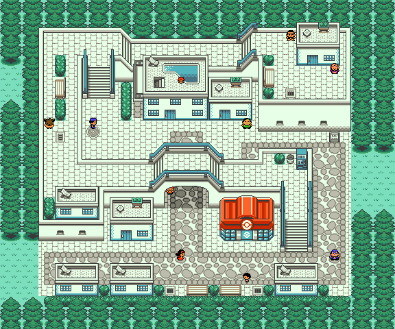

# Lacunosa Town

This demonstrates the map I made for the [Fangame Hacktory](https://twitter.com/fangamehacktory)'s [Time Warp Mapoff](https://twitter.com/fangamehacktory/status/1201308583096307714): a Gen 2 demake of Unova's Lacunosa Town from Gen 5, Pokémon Black and White.

It takes advantage of the [Polished Crystal](https://github.com/Rangi42/polishedcrystal) engine to allow [more than 256 tiles](https://github.com/pret/pokecrystal/wiki/Expand-tilesets-from-192-to-255-tiles), [tiles that overlap NPC sprites](https://github.com/pret/pokecrystal/wiki/Allow-map-tiles-to-appear-above-sprites-\(so-NPCs-can-walk-behind-tiles\)-with-PRIORITY-colors), [lots of sprites in one map](https://github.com/pret/pokecrystal/wiki/Allow-more-than-15-object_events-per-map), [sideways stairs](https://github.com/pret/pokecrystal/wiki/Sideways-stairs-with-diagonal-movement), and plenty else. Partly I wanted to prove that it's not a cheat, it really can be done in Gen 2. :P

Another hack that's using these features is [Red++ v4](https://github.com/TheFakeMateo/RedPlusPlus). It's only scripted up to Cerulean City so far, but the [entire overworld](https://github.com/TheFakeMateo/RedPlusPlus/tree/master/notes/map%20stitches) is mapped out.

## Download and Play

To play, download the .ips patch file, and use a tool like [Lunar IPS](http://fusoya.eludevisibility.org/lips/) (for Windows), [MultiPatch](http://projects.sappharad.com/tools/multipatch.html) (for OS X), or [UniPatcher](https://play.google.com/store/apps/details?id=org.emunix.unipatcher&hl=en) (for Android) to apply the patch to a default Crystal ROM.

This is the ROM you should use:

* Pokémon - Crystal Version (UE) (V1.0) [C][!].gbc  
  (`md5: 9f2922b235a5eeb78d65594e82ef5dde`)

It's identical to the one built by the [pokecrystal](https://github.com/pret/pokecrystal) project.

This is the patch you should use:

* [lacunosatown-1.0.0.ips](patches/lacunosatown-1.0.0.ips)  
  (IPS patch file `md5: 1cd1fcfacb22706741393ca413884ce3`)  
  (Patched GBC ROM `md5: 3b8246e8cd8fad9a8f802a84dedda01c`)

Or you can follow the instructions in [INSTALL.md](INSTALL.md) to build it yourself from the source code, no base ROM necessary.

## Credits

* FIQ for the dynamic sprite loading, essential to making the blue guardrails work with NPCs
* luckytyphlosion for performance optimizations essential to having the map run smoothly
* WasabiRaptor for implementing sideways stairs, another essential feature of Lacunosa Town
* Pia Carrot for demaking the B/W trees
* bloodless and frozenLake for demaking the OR/AS Pokémon Center roof, which I edited
* Luna for demaking the FR/LG vending machine, which I edited
* JaceDeane and Poketto for demaking the sprites of Hilbert and Hilda
* COMBOY for demaking the sprite of Prof. Juniper
* Mmmmmm for demixing the Lacunosa Town music
* Everyone who's contributed to pokecrystal and Polished Crystal :D
