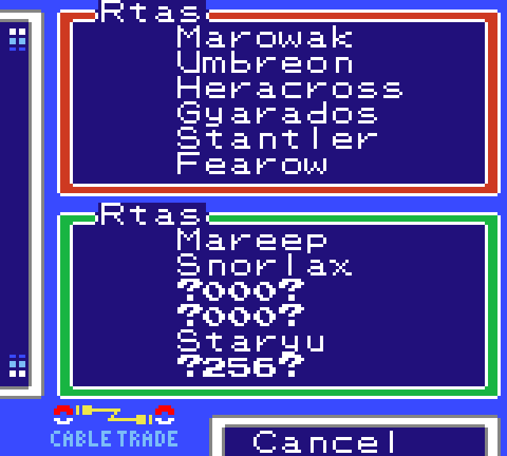
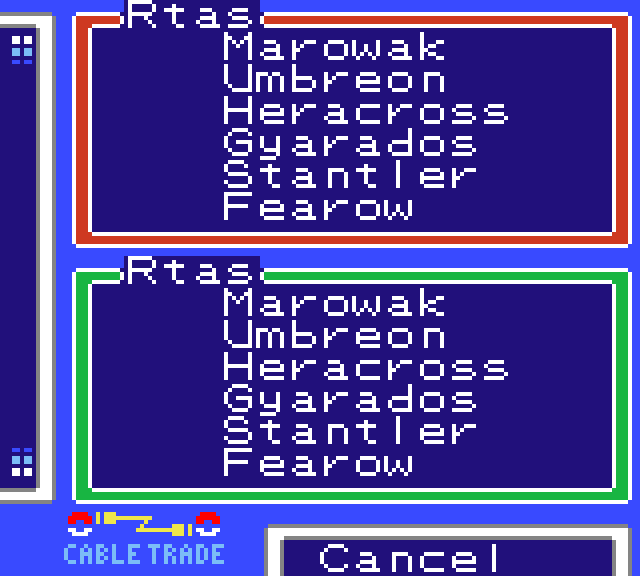

# Issue #1179 reproduction and regression evidence

Investigation by Chatgpt Astra.

The bug is present in the official faithful 3.1.1 release and master
`f27896d8945c57c7fda660a8bb1bedee4293f1a8`. Rtas's player ID is `$75FE`.
`FixDataForLinkTransfer` starts seven bytes too late: it misses both player-ID
bytes and the first five bytes of the first party Pokémon. The receiver's
`Link_CopyOTData` skips the unescaped `$FE`, shifting the following data.
This is deterministic serialization corruption, independent of cable timing.
The fix aligns the encoded and decoded patch-list origins with the player ID.
It also removes the obsolete party-species list from the decoded layout and
uses the actual decoded payload length. Link version/minimum trade version
become 5 because old patch offsets are incompatible.

## Screenshots

These are actual vibeEmu PPU captures, enlarged 4x with nearest-neighbor scaling.
The same Rtas party is shown as both local and received party. The ROM's own
trade-screen routines draw both panels; no species text is supplied by the test.
Normal font and instant text are selected in RAM for the capture.
The attached save's party order differs from the original issue screenshots.

| Before (master) | After (fixed master) |
| --- | --- |
|  |  |

## Scope and results

This is a ROM-routine test, not a two-console cable session. The probe loads the
attached v9 player/party sections directly into WRAM, calls the real preparation
and escaping routines, supplies an ideal byte transfer, then executes the real
receiver copy, patch application and party extraction. Mail, serial interrupt
timing, completed trades, summary-screen navigation and the separate `SC_FAST`
desync are not tested. No playthrough or on-disk save modification is needed.
The current master player/party save sections retain the offsets used here;
this is not a complete v9-to-v10 save migration.

- Official faithful 3.1.1 and unmodified master reproduce corruption with Rtas:
  265 of 288 party bytes differ. See `release-before.txt` and `before.txt`.
- Changing **only** the player ID in RAM from `$75FE` to `$75FD` eliminates the
  unmodified-master corruption; Pokémon OT IDs remain unchanged.
- Kido's original attached party transfers correctly on unmodified master.
- Fixed faithful and non-faithful ROMs preserve both attached valid saves'
  player IDs, all active party bytes, OT names and nicknames exactly.
- Independent `$FE` injections at all 290 player-ID/party byte positions pass,
  including the end of part 1, start of part 2 and final party byte.
- Both trade and battle version checks reject peer versions 3/4 and accept 5.
- Faithful build and a clean non-faithful build pass (`make -j4 faithful`, then
  after preserving the ROM/symbols, `make tidy && make -j4`).
- Reviewed the [assembly optimization guide](https://github.com/pret/pokecrystal/wiki/Optimizing-assembly-code).
  `python3 utils/optimize.py` reports zero instances; `git diff --check` passes.

## Save and patcher checks

Both Rtas and Kido have valid primary and backup v9 checksums:
Rtas `$DAA5`, Kido `$B777`. Their trainer IDs are `$75FE` and `$D71A`.
The attached `PCFAITHFUL.dmp` cannot serve as a valid control: version bytes,
primary/backup player sections and stored checksums are `$FF`; calculated
checksums are `$6F85`, not the stored `$FFFF`. No conclusion about its in-game
history follows from that attachment.

The [save patcher](https://github.com/fellowship-of-the-roms/polished-save-patcher/tree/b3f39c95b2603016bd01a1e38246bcd9799ed2c6)
was reviewed without modifications. `PatchVersion8to9.cpp` starts with
`save9 = save8`, preserves the trainer-ID area, and copies the party block;
`PatchVersion9to10.cpp` also begins with a save copy. There is no evidence here
that the patcher caused this link failure. The original affected v9 save and
original ROM reproduce it without running the patcher at all. This review is
not a claim that every historical patcher version is bug-free.

Original attachments remain available from
[issue #1179](https://github.com/Rangi42/polishedcrystal/issues/1179).
SHA-256:

```
b5ec36ca4a95192f802c714a17da918fa79642285da20e3a8dc9289142b79b8e  polishedcrystal-faithful-3.1.1.dmp
21f2f7510fb61f99ac8496451bb426fa823e26f15a9bd8973018ba72659e7e15  Polished.Crystal.3.1.1.update.dmp
3c4d25c7849091359013615a14800e1cfc8b021027290e84a9d2e3cbe79b3017  PCFAITHFUL.dmp
```

## Reproduce

Requires Rust, Python 3, locally built ROMs with adjacent `.sym` files, and the
issue's two valid `.dmp` attachments. The probe uses vibeEmu core revision
`4ea2c53cb9caadf5c56d72bdb1f465b715238799` without modifying the emulator.
Build its dependency-free core directly, with outputs in `/tmp`:

```sh
CARGO_PKG_VERSION=0.0.2 rustc --edition=2024 --crate-name vibe_emu_core \
  --crate-type rlib -O ../vibeEmu/crates/vibe-emu-core/src/lib.rs \
  -o /tmp/libvibe_emu_core.rlib
rustc --edition=2024 -O probe.rs \
  --extern vibe_emu_core=/tmp/libvibe_emu_core.rlib -o /tmp/link-party-probe
python3 run_checks.py /tmp/link-party-probe BEFORE.gbc AFTER.gbc \
  polishedcrystal-faithful-3.1.1.dmp Polished.Crystal.3.1.1.update.dmp
/tmp/link-party-probe BEFORE.gbc polishedcrystal-faithful-3.1.1.dmp /tmp/before screen
/tmp/link-party-probe AFTER.gbc polishedcrystal-faithful-3.1.1.dmp /tmp/after screen
```

`screen` emits a raw PPM framebuffer plus expected/received party bytes.
`check` asserts an exact round trip; numbers 0..289 select an injected `$FE`.
The same probe runs against the official 3.1.1 faithful ROM and release symbols.
