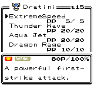

# Pokémon Polished Crystal

This is a custom Pokémon game based on [the Pokémon Crystal disassembly](https://github.com/pret/pokecrystal).

My goal is to create what the title says: an improved, polished version of Pokémon Crystal. It fixes bugs, takes into account the official game changes since 2001, and adds some new ideas of my own. Many features restore what was removed from R/B/Y, or original to HG/SS.

I've had vague plans to make a Pokémon game for years. I'm very impressed by the effort that's gone into disassembling Pokémon Crystal and making the code so well-organized. Thanks to making it open-source (and to the ROM hackers that inspired me), I'm finally making this game a reality.

## Download and Play

The most recent version is 1.1.2 as of August 2, 2016.

To play, download the .ips patch file, and use a tool like [Lunar IPS](http://fusoya.eludevisibility.org/lips/) (for Windows), [MultiPatch](http://projects.sappharad.com/tools/multipatch.html) (for OS X), or [UniPatcher](https://play.google.com/store/apps/details?id=org.emunix.unipatcher&hl=en) (for Android) to apply the patch to a default Crystal ROM.

This is the ROM you should use:

* Pokémon - Crystal Version (UE) (V1.0) [C][!].gbc  
  (`md5: 9f2922b235a5eeb78d65594e82ef5dde`)

It's identical to the one built by the [pokecrystal](https://github.com/pret/pokecrystal) project.

There are two patches for Polished Crystal. The "faithful" patch does not change any Pokémon base stats or move attributes beyond the updates in Gen VI. The regular patch has some custom changes for more diverse and viable Pokémon.

* [Pokémon Polished Crystal 1.1.2](patches/polishedcrystal-1.1.2.ips)  
  (Patched ROM `md5: b6aaa84f3aec1924ba260d5e1018459e`)
* [Pokémon Polished Crystal (Faithful) 1.1.2](patches/polishedcrystal-faithful-1.1.2.ips)  
  (Patched ROM `md5: 1945c529b78b4710dc136e627ee8d67b`)

## Features

* Added locations from R/B/Y and HG/SS: Viridian Forest, Pewter Museum, Celadon Hotel, Silph Co., Pokémon Mansion, Seafoam Islands, Cerulean Cave, Goldenrod PokéCom Center, and Bellchime Trail
* New locations, including Cinnabar Volcano, Cherrygrove Bay, Goldenrod Harbor, a new floor of Rock Tunnel, and custom-designed PokéWalker routes
* Battle more trainers, including Lorelei, Agatha, and Bill
* New trainer classes: Elder, Rich Boy, Schoolgirl, Cowgirl, Battle Girl, Hex Maniac, and Guitarist♀
* Get a Silver Trophy when you beat the Elite 4 and a Gold Trophy when you rematch them at higher levels
* Rematch Gym Leaders in the Fighting Dojo
* Wonder Trade up to three times a day in the Goldenrod PokéCom Center
* Move Reminder in the same house as the Move Deleter
* Beating Red is not the end of the game

* The Fairy type, with the Pink Bow as its type-enhancing item
* Type chart, base stats, and move attributes all updated to Gen VI
* Physical/Special/Status split

* Catch all ~~251~~ 253 Pokémon without trading, some earlier than in GSC or HGSS
   * Added: Leafeon, Glaceon, Sylveon, Magnezone, Tangrowth, Porygon-Z, Munchlax, Togekiss, Yanmega, Honchkrow, Mismagius, Gliscor, Weavile, and Mamoswine (sprite artists in [the credits](CREDITS.md))
   * Removed: Spearow, Fearow, Lickitung, Goldeen, Seaking, Cleffa, Igglybuff, Sunkern, Sunflora, Wobbuffet, Shuckle, and Delibird
   * Trade evolutions now evolve by level or by held item
   * Fossils can be revived in the Pewter Museum of Science

* New moves from future generations
   * Added: Air Slash, Aqua Tail, Astonish, Avalanche, Bug Buzz, Bulk Up, Bullet Punch, Calm Mind, Dark Pulse, DazzlinGleam, Disarm Voice, Dragon Claw, Dragon Dance, Dragon Pulse, Drain Kiss, Earth Power, Extrasensory, Fairy Wind, Flare Blitz, Flash Cannon, Focus Blast, Gunk Shot, Hex, Hyper Voice, Iron Head, Metal Sound, Moonblast, Nasty Plot, Night Slash, Play Rough, Poison Jab, Power Gem, Psystrike, Razor Shell, Seed Bomb, Shadow Claw, Stone Edge, Wild Charge, Will-O-Wisp, X-Scissor, and Zen Headbutt
   * Removed: Acid Armor, Amnesia, Barrage, Beat Up, Bide, Bind, Bone Club, Bone Rush, Clamp, Constrict, Cotton Spore, Detect, Fissure, Frustration, Guillotine, Horn Drill, Jump Kick, Kinesis, Lovely Kiss, Mega Kick, Mega Punch, Mimic, Mind Reader, Mirror Move, Poison Gas, Present, Psych Up, Psywave, Razor Wind, Rolling Kick, Sharpen, Skull Bash, Smog, Snore, Spider Web, Spite, Sweet Scent, Vice Grip, and Withdraw
* Revised set of 65 TMs, 8 HMs, and 16 move tutors
* Revised in-game trades
* Revised Game Corner prizes
* New items, including four Poké Balls, three fossils, Eviolite, and X Spcl. Def

* Lowercase Pokémon, moves, items, types, names, etc
* Fast text by default
* Stereo sound by default
* Updated language (Pack → Bag, Enemy → Foe, Cooltrainer → Ace Trainer, Fisher → Fisherman, Elixer → Elixir, Pink Bow → Silk Scarf, new Berry names, etc)
* Added decorative features to cities and routes, often from HGSS (lake in front of Sprout Tower, Magnet Train tracks on Route 32, water feature in Ecruteak City, boardwalk in Olivine City, bridge in Victory Road, fancy Prof. Oak's lab, meteorite debris on Route 3, craters in Mt. Moon, fountains in Cerulean City and Celadon City, colored roofs throughout Kanto)
* HGSS-style Town Map

* Updated gameplay elements
   * Hold B to use Running Shoes
   * Unlimited-use TMs (also more expensive)
   * Continuous Repel system
   * Gain experience from catching Pokémon
   * Lose money when blacking out based on your Pokémon level and number of badges
   * Play low-pitched cries when a player or foe Pokémon faints
   * Cure poison when it reaches 1 HP outside a battle
   * Eggs hatch at level 1
   * Surf at Bicycle/Running Shoes speed
   * Pokédex area display uses whiever region you're in
   * Maximum $9,999,999 money and 50,000 coins
   * Maximum 30 items and 16 Balls in your bag
   * Mineral Badge, not Storm Badge, makes Pokémon up to L70 obey, like in HG/SS
   * Fishing works 75% of the time, not 50%

* Updated battle mechanics
   * Type-enhancing items raise by 20%, not 10%
   * Light Ball doubles Pikachu's Attack as well as Special Attack
   * Critical hits do 150% damage, not 200%, but are more likely
   * Electric-type Pokémon are immune to paralysis, even from Tri Attack
   * Ice-type Pokémon are immune to freezing, even from Tri Attack
   * Fire-type Pokémon are immune to burns, even from Tri Attack
   * Steel-type Pokémon are immune to poisoning
   * Poison-type Pokémon always hit with Toxic
   * Curse is Ghost-type
   * Roar, Whirlwind, and Struggle are unaffected by accuracy or evasion, like Swift
   * Growth raises Attack and Special Attack, by two stages in sunlight
   * Hidden Power is always 70 power
   * Double-Edge and Flare Blitz do 33% recoil damage
   * Twineedle checks for poison after each hit
   * Sandstorm does 1/16 damage per turn
   * Substitute blocks Transform, Swagger, and trapping moves; does not block draining moves; and prevents gaining money from Pay Day
   * Protect works from behind a Substitute
   * Struggle does 25% of max HP recoil damage
   * Sleep lasts 1-3 turns, not 1-7
   * 20% chance to defrost each turn, not 10%
   * Disable lasts for 4 turns
   * Waterfall has a 20% flinch chance
   * X Accuracy boosts accuracy, it does not ignore accuracy checks entirely
   * Leppa Berry (formerly MysteryBerry) restores 10 PP, not 5
   * Sitrus Berry (formerly Gold Berry) restores 25% of max HP, not 30 HP
   * Paralyze and Freeze animations play each turn

* Fixed bugs:
   * Dragon Fang boosts Dragon-type moves, not Dragon Scale
   * Burn/Poison/Paralyze improve catch rate
   * Moon Ball catches Moon Stone evolvers
   * Love Ball catches opposite sex
   * Fast Ball catches flee-prone Pokémon
   * Medium-Slow growth rate experience underflow at level 1
   * HP bar lowers at the same speed even for high HP
   * Belly Drum needs to cut HP to raise Attack
   * Lake of Rage Magikarp are larger, not smaller
   * Rocket Executives use Team Rocket battle music, not just Grunts
   * The Ruins of Alph tile with their surrounding maps

* Increased difficulty:
   * Default Set battle style
   * Enemy AI doesn't fail an extra 25% of the time with sleep or poison-inducing moves, or 40% of the time with stat drops
   * No badge boosts to stats or types
   * Improved items used by some trainers
   * Improved some trainers' rosters, movesets, and DVs (particularly Gym Leaders, the Elite Four, and other bosses)
   * Raised wild Pokémon levels in Kanto to 40–50

* Shiny Pokémon changes:
   * Shiny Pokémon have an odd Attack DV, 2, 3, 7, or 11 Defense, 5 or 13 Speed, and perfect 15 Special, so 1/1024 Pokémon is shiny
   * Revised some shiny palettes (Dragonite is blue like Dragonair, Nidoqueen is pink like Nidoking, Scizor is silver, Espeon is sky blue, Electabuzz is red, etc)
   * A few NPC trainers have shiny Pokémon
   * The Odd Egg is always shiny, with an equal chance to be either gender

* Restored original Japanese sprites for Beauty, Fisher, Medium, Sage, and Swimmer♀
* Replaced sprite for Twins with a devamped one from B/W
* New music ported from RBY and devamped from future generations (see [the credits](CREDITS.md) for who composed it)
* Unique mini sprites for each Pokémon (thanks to [this patch](http://www.pokecommunity.com/showthread.php?t=338470))

* Three of Prof. Oak's aides give you items as you complete the Pokédex
* Bill's grandpa gives you one of each evolutionary stone in Goldenrod City
* Nidorina and Nidoqueen can breed
* Fly to the Rock Tunnel/Power Plant Pokémon Center
* Always show numbers in Pokédex, even in Johto order
* Color-coded starter Poké Balls
* Get all the items, including all Berries on new trees, evolution stones in Celadon Dept. Store, and more kinds of Mail
* Brass Tower → Gong Tower (かね *kane* can mean 金 "metal" or 鉦, a gong-like bell)

* Non-canon Pokémon and move attributes:
   * Many base stat changes, mostly based on [Drayano's Sacred Gold/Storm
     Silver](https://gbatemp.net/threads/pok%C3%A9mon-sacred-gold-storm-silver.327567/)
   * Cut is Steel-type, and has 60 power and 100% accuracy
   * Hidden Power is ???-type and has 70 power
   * Metronome is ???-type
   * Sing has 75% accuracy (matching Lovely Kiss)
   * Supersonic has 65% accuracy
   * Fly has 100% accuracy
   * Rock Smash has 75 power
   * Pain Split is Ghost-type
   * Blastoise is Water/Steel
   * Butterfree is Bug/Psychic
   * Persian is Normal/Dark
   * Farfetch'd is Fighting/Flying
   * Ninetales is Fire/Ghost
   * Golduck is Water/Psychic
   * Meganium is Grass/Fairy
   * Typhlosion is Fire/Ground
   * Feraligatr is Water/Dark
   * Noctowl is Flying/Psychic
   * Ledian is Bug/Fighting
   * Dunsparce is Normal/Ground
   * Mismagius is Ghost/Fairy

## Screenshots

  

  

  

  

  

  

  

  

  

  

## Bugs

* The Move Reminder doesn't list all the possible moves.
* Sitrus Berry heals 25% max HP when used, but 30 HP when held.
* Thief permanently steals held items.
* TMs can restore PP.
* Avalanche's power doesn't double.

## FAQ

**Is there a Pokédex document I can refer to?**

The game's data files do a fairly good job of listing things you'll want to know.

* [Base stats and TM learnsets](data/base_stats/)
* [Level-up learnsets and evolution methods](data/evos_attacks.asm)
* [Egg moves](data/egg_moves.asm)
* [Move attributes](battle/moves/moves.asm)
* [TM+HM+tutor list](engine/tmhm.asm) (scroll to the bottom)
* [Wild Pokémon](data/wild/)

**How do I evolve Leafeon? Glaceon? Sylveon? Magnezone?**

* Eevee evolves into Leafeon in Ilex Forest, site of the Moss Rock.
* Eevee evolves into Glaceon in the Ice Path, site of the Ice Rock.
* Eevee evolves into Sylveon with a Shiny Stone.
* Magneton evolves into Magnezone in Rock Tunnel, site of the Lodestone.

**Where do I get the legendary Pokémon?**

* Articuno is in the Seafoam Islands.
* Zapdos is above the Power Plant after you fix the generator.
* Moltres is inside Cinnabar Volcano.
* Raikou and Entei are roaming Johto.
* Suicune is in the Bell Tower after you get the Clear Bell.
* Lugia is in the Whirl Islands after you catch all three legendary birds and get the Silver Wing. You'll receive the Silver Wing by triggering a certain event in Victory Road.
* Ho-Oh is atop the Bell Tower after you catch all three legendary beasts and get the Rainbow Wing. You'll receive the Rainbow Wing in the Bell Tower.
* Mewtwo is in Cerulean Cave.
* Mew and Celebi are a secret!

**I don't like non-canon Pokémon types!**

I was hesitant to make original changes like this, because the goal is to be an improved Crystal version, not a new game. In the end I made two versions, one regular (with changes) and one "faithful" (with original typings).

## Changes in 1.2.0

These changes have been made since the previous 1.1.2 release. If you build the project as-is, it will include all of them.

* Add: Replace {Hoppip, Skiploom, Jumpluff, Aipom, Stantler, Smoochum} with {Rhyperior, Electivire, Magmortar, Sunkern, Sunflora, Wobbuffet}.
* Add: Add Protector, Electirizer, and Magmarizer items.
* Add: Replace Synthesis with Hurricane.
* Add: Lyra is your friendly rival.
   * Battle Lyra in Prof. Elm's lab.
* Add: Battle Cal in Trainer House if you're a girl, Kay if you're a boy
* Add: Meganium can learn Calm Mind.
* Add: Pokémon sprites for Joey and Mike's battle and for Amphy.
* Add: Rocket Executive in Slowpoke Well.
* Add: Pokémon are found via Headbutt on Route 47+48 and in Yellow Forest.
* Add: Restore unused dialog about Prof. Silktree to the Ruins of Alph.
* Add: Politoed is Water/Grass.
* Add: Sunflora is Grass/Fire.
* Add: Electivire is Electric/Fighting.
* Add: Magmortar is Fire/Steel.
* Fix: Replace Pryce's Seel and Shellder with Piloswine and Sneasel.
* Fix: Replace broken Trainer House tiles with a Poké Ball pattern.
* Fix: Typo "your" for "you" (thanks, jpmac26).
* Fix: Ellipses print too high during battle (thanks, comet).
