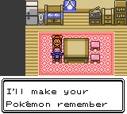
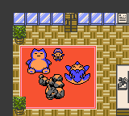
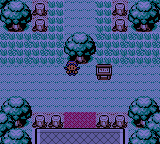

# Pokémon Polished Crystal

This is a custom Pokémon game based on [the Pokémon Crystal disassembly](https://github.com/pret/pokecrystal).

My goal is to create what the title says: an improved, polished version of Pokémon Crystal. It fixes bugs, takes into account the official game changes since 2001, and adds some new ideas of my own. Many features restore what was removed from R/B/Y, or original to HG/SS.

I've had vague plans to make a Pokémon game for years. I'm very impressed by the effort that's gone into disassembling Pokémon Crystal and making the code so well-organized. Thanks to making it open-source (and to the ROM hackers that inspired me), I'm finally making this game a reality.

## Download and Play

The most recent version is 2.0.0 as of September 7, 2016.

To play, download the .ips patch file, and use a tool like [Lunar IPS](http://fusoya.eludevisibility.org/lips/) (for Windows), [MultiPatch](http://projects.sappharad.com/tools/multipatch.html) (for OS X), or [UniPatcher](https://play.google.com/store/apps/details?id=org.emunix.unipatcher&hl=en) (for Android) to apply the patch to a default Crystal ROM.

This is the ROM you should use:

* Pokémon - Crystal Version (UE) (V1.0) [C][!].gbc  
  (`md5: 9f2922b235a5eeb78d65594e82ef5dde`)

It's identical to the one built by the [pokecrystal](https://github.com/pret/pokecrystal) project.

*If you want to do a [Nuzlocke Challenge](http://bulbapedia.bulbagarden.net/wiki/Nuzlocke_Challenge), check out Nuzlocke mode in the Option menu!*

There are two patches for Polished Crystal. The "faithful" patch does not change any Pokémon base stats or move attributes beyond the updates in Gen VI. The regular patch has some custom changes for more diverse and viable Pokémon.

* [Pokémon Polished Crystal 2.0.0](patches/polishedcrystal-2.0.0.ips)  
  (IPS patch file `md5: 25ceb4c59163eec39a37b5449cd28478`)  
  (Patched GBC ROM `md5: 6ecb7d3e80d894523f45a1155bcf7732`)
* [Pokémon Polished Crystal (Faithful) 2.0.0](patches/polishedcrystal-faithful-2.0.0.ips)  
  (IPS patch file `md5: 1c6b9c74bc8fdbc0f9d8b4d9a852366c`)  
  (Patched GBC ROM `md5: 353f387a1a7b88a58d35fd2f5059e792`)

## Features

A full list of features is in [FEATURES.md](FEATURES.md). Some highlights:

* 253 Pokémon, including some new evolutions.
* 48 new moves.
* 65 TMs and 21 move tutors.
* Many new mechanics, including the Fairy type, Physical/Special split, unlimited TMs, Running Shoes, and continuous Repel.
* New maps: some restored from R/B/Y, some devamped from HG/SS, and some original.
* New characters, including Lorelei and Agatha from R/B/Y, Lyra and the Team Rocket Executives from HG/SS, and others.
* Steadily increasing challenges throughout the game, with new post-game content that climaxes in a level 100 battle.
* Music and graphics devamped from other versions.
* Nuzlocke mode in the Option menu, enabling the basic rules of the [Nuzlocke Challenge](http://bulbapedia.bulbagarden.net/wiki/Nuzlocke_Challenge).

## Screenshots

  

  

  

  

  

  

  

  

  

  

## FAQ

**Is there a Pokédex document I can refer to?**

The game's data files do a fairly good job of listing things you'll want to know.

* [Base stats and TM learnsets](data/base_stats/)
* [Level-up learnsets and evolution methods](data/evos_attacks.asm)
* [Egg moves](data/egg_moves.asm)
* [Move attributes](battle/moves/moves.asm)
* [TM+HM+tutor list](engine/tmhm.asm#L48)
* [Wild Pokémon](data/wild/)

**How do I evolve my Pokémon?**

* Item trade evolutions (like Seadra into Kingdra while holding a Dragon Scale) now evolve while holding the item.
* Yanma, Tangela, and Piloswine evolve while knowing AncientPower.
* Eevee evolves into Leafeon in Ilex Forest, site of the Moss Rock.
* Eevee evolves into Glaceon in the Ice Path, site of the Ice Rock.
* Eevee evolves into Sylveon with a Shiny Stone.
* Magneton evolves into Magnezone in Rock Tunnel, site of the Lodestone.
* Machoke, Graveler, Haunter, and Kadabra evolve by having sufficient stat exp in Attack, Defense, Speed, and Special respectively (five Protein, Iron, Carbos, or Calcium is enough).

**Where do I get the legendary Pokémon?**

* Articuno is in the Seafoam Islands.
* Zapdos is above the Power Plant after you fix the generator.
* Moltres is inside Cinnabar Volcano.
* Raikou and Entei are roaming Johto.
* Suicune is in the Bell Tower after you get the Clear Bell.
* Lugia is in the Whirl Islands after you catch all three legendary birds and then get the Silver Wing in Victory Road.
* Ho-Oh is atop the Bell Tower after you catch all three legendary beasts and then get the Rainbow Wing in Bell Tower.
* Mewtwo is in Cerulean Cave.
* Mew and Celebi are a secret!

**Where do I get this item?**

* The Razor Claw is in Quiet Cave, or held by some wild Sneasel.
* The Razor Fang is in Victory Road, or held by some wild Gligar.
* The Electirizer is in Rock Tunnel, or held by some wild Electabuzz.
* The Magmarizer is on Cinnabar Island, or held by some wild Magmar.
* The Protector is in Mt. Mortar, or held by some wild Rhydon.
* The Up-Grade is given to you in Silph Co. after fixing the Power Plant generator.
* The Dubious Disc is in Celadon City.
* The Metal Coat is in the Goldenrod Dept. Store basement, or held by some wild Magnemite, Magneton, and Steelix.
* King's Rocks are in Slowpoke Well and the Seafoam Islands, or held by some wild Slowpoke, Slowbro, and Poliwhirl.
* Dusk Stones are in Dark Cave, Quiet Cave, Cerulean Cave, and Mt. Moon. Bill's grandpa also gives you one.
* Shiny Stones are in National Park, Cherrygrove Bay, and Mt. Moon. Bill's grandpa also gives you one.
* Bill's grandpa gives you one of each evolution stone in Goldenrod City. Also, certain trainers will call you up to give you stones, just like in regular Crystal. The Celadon Dept. Store sells the Fire, Water, Thunder, and Leaf Stones.

**What do blessings and photographs do?**

Daily blessings in Ecruteak City and photographs in Cianwood City make your Pokémon happier, just like haircuts or grooming.

**I don't like non-canon Pokémon types!**

I was hesitant to make original changes like this, because the goal is to be an improved Crystal version, not a new game. In the end I made two versions, one regular (with changes) and one "faithful" (with original typings).

## Bugs

[TODO.md](TODO.md) contains a full list of possible future changes, including these bugs to fix:

* Nuzlocke mode sometimes turns on by itself.
* The Move Reminder doesn't list all the possible moves.
* Thief permanently steals held items.
* TMs can restore PP.
* NPC trainers overuse Baton Pass.
* Some NPC trainers incorrectly use X Spcl. Atk.
* Avalanche's power doesn't double if the user is hit first.

## Changes in 2.0.1

These changes have been made since the previous 2.0.0 release. If you build the project as-is, it will include all of them.

* Add: Item balls for TMs are blue (based on Gen VI's yellow).
* Add: The Zephyr Badge lets you use traded Pokémon up to level 20.
* Add: Some boss trainers only use Gen VI evolutions in rematches.
* Add: Respawn Sudowoodo if uncaught after the Elite Four, like legendaries.
* Add: Splash effect in puddles.
* Add: Mantine can learn Fly.
* Add: Crabhammer has 95% accuracy.
* Add: Unique wild moves are rarer (25%, not 50%).
* Add: Move Nuzlocke mode option away from common ones.
* Fix: Flash no longer requires the Zephyr Badge, since earning the Zephyr Badge requires using Flash.
* Fix: The Rocket Grunt♀ who gives you a password has a glitched unbeatable team.
* Fix: The Day-Care gives back fainted Pokémon in Nuzlocke mode.
* Fix: Calling Bill to switch boxes corrupts the PC.
* Fix: Destiny Bond glitch.
* Fix: Ecruteak fairy-tale house crash.
* Fix: Bellchime Trail crash.
* Fix: Conditions for Bellchime Trail event.
* Fix: Swimmer♂s on Route 40+41 have the Super Nerd sprite.
* Fix: Viewing the Ruins of Alph wall patterns crashes the game.
* Fix: Incorrect cries for some Pokémon.
* Fix: TM learnsets for Electivire, Magmortar, and Rhyperior.
* Fix: Icicle Crash is still called Razor Shell.
* Fix: A battle with Lyra is skippable.
* Fix: Two trainers overlap on the S.S. Aqua.
* Fix: Plural trainers say "are about to use", not "is about to use".
* Fix: Viridian Forest is dark.
* Fix: S.S. Aqua location on Town Map.
* Fix: Tile error in Cherrygrove Bay.
* Fix: Twins Ann & Anne → Twins Tori & Til.
* Fix: Lass's text spread over multiple lines.
