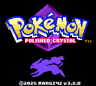
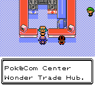
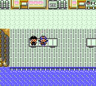
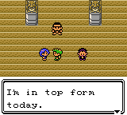
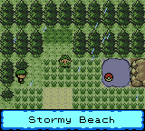

# Pokémon Polished Crystal

This is a custom Pokémon game based on [the Pokémon Crystal disassembly](https://github.com/pret/pokecrystal).

My goal is to create what the title says: an improved, polished version of Pokémon Crystal. It fixes bugs, takes into account the official game changes since 2001, and adds some new ideas of my own. Many features restore what was removed from R/B/Y, or original to HG/SS.

I've had vague plans to make a Pokémon game for years. I'm very impressed by the effort that's gone into disassembling Pokémon Crystal and making the code so well-organized. Thanks to making it open-source (and to the ROM hackers that inspired me), I'm finally making this game a reality.

> There are many ways to create games but the way we work at Game Freak may be a little different from other companies. That is, we constantly change and tweak what we have come up with. To make a fun game even more fun and polish it up, we take what we have made and start thinking about it from scratch. And to make the game the most fun to play we make endless changes and tweaks no matter how long it takes. It may not be the best way, but I think these tweaks are important to make our games fun and better.
>
> — Junichi Masuda, "[HIDDEN POWER of masuda No. 7](https://www.gamefreak.co.jp/blog/dir_english/?p=21)"

## Download and Play

The **current official release** is **v3.2.2** (the “Polished Crystal” release). It's fully playable from start to finish and includes major overhauls to gameplay, mechanics, and quality of life. A more detailed changelog is forthcoming, but you can find the major highlights below.

- **[Download v3.2.2 here](https://github.com/Rangi42/polishedcrystal/releases/tag/v3.2.2)**

The previous official version was [v3.1.1](https://github.com/Rangi42/polishedcrystal/releases/tag/v3.1.1) (February 1, 2025).

*If you have any questions about playing or patching, [read the FAQ](FAQ.md)!*

## What’s New in v3.2.2

Below is a brief summary of the major changes and additions. A more detailed changelog will be released soon.

- **Customizable New Game Setup:** You can now toggle Natures and Abilities on/off, choose how EVs work (classic no-limit, modern 510 limit, or disabled), and configure various other gameplay options before starting a new adventure.
- **DVs No Longer Determine Natures/Shininess/Gender/Unown Form:** DVs still affect color variation (slightly different hues for the same species), but everything else is now handled separately.
- **Overhauled Battle Engine and HUD:**
  - Abilities are now supported.
  - Moves have been updated to behave more like their modern counterparts.
  - Minor HUD improvements make battles more streamlined.
- **Revamped Move Animations:** Many moves have updated animations.
- **Optimized Engine and 60fps Overworld:** The game engine has been heavily optimized for smoother performance, and the overworld now runs at 60 frames per second.
- **Storage System Redesign:** The PC storage interface is more like modern Pokémon games. You can switch boxes, move Pokémon around, and manage your party with minimal saving hassles.
- **HGSS-Inspired Pokédex:** The new Pokédex includes base stats, egg groups, and a more comprehensive encounter map showing *all* methods of obtaining Pokémon.
- **Enhanced Overworld Weather:** Instead of just darkening the screen, you’ll now see proper rain, snow, or sandstorms in applicable areas.
- **Revamped Summary Screen:** Replaces the vanilla stats screen. Shows nature, abilities, seen and caught data, and more.

## Features

A full list of features is in [FEATURES.md](FEATURES.md). Some highlights:

- **289 Pokémon species**, including some new evolutions, plus **56 cosmetic forms** (e.g., Magikarp patterns, Pikachu Fly/Surf, Arbok patterns, Unown Forms) and **46 variants** (Alolan, Galarian, Hisuian, etc.)—for a total of **391 unique Pokémon**.
- **73 new moves** (72 on faithful builds), **75 TMs**, and **31 move tutors**.
- Modern mechanics, such as the **Fairy type**, **Physical/Special split**, **Natures**, **Abilities**, and more.
- **Unlimited TMs** and quality-of-life features like **Running Shoes** and continuous **Repel**.
- **New/Revamped Maps**: Some from R/B/Y, some devamped from HG/SS, plus original locations.
- **New Characters** including Lorelei and Agatha (R/B/Y), Lyra and the Team Rocket Executives (HG/SS), and others.
- **More Post-Game Content**: Gym Leader rematches, a new event after battling Red, and more.
- **Improved Level Curve** with steadily increasing challenges.
- **Music and Graphics** devamped from newer generations.

## Discussion

If you have questions or comments, please check or post on any of these sites. (Read the [FAQ](FAQ.md) first if you have general questions!)

- [Discord](https://discord.gg/ZK5pqK8)
- [Skeetendo](https://hax.iimarckus.org/topic/6874/)
- [PokéCommunity](http://www.pokecommunity.com/showthread.php?t=373172)
- [Romhack.me](http://www.romhack.me/polishedcrystal/wall/)
- [/r/PokemonROMHacks](https://www.reddit.com/r/PokemonROMhacks/comments/51kbcn/pok%C3%A9mon_polished_crystal_200/)
- [Nuzlocke Forums](http://s7.zetaboards.com/Nuzlocke_Forum/topic/11003710/)
- [Pokémon Hackers Online](http://www.pokemonhackersonline.com/showthread.php?t=15811)

Additional resource:

- [PolishedDex](https://www.polisheddex.app/) — An online companion for Polished Crystal. PolishedDex provides a searchable Pokédex, move list, item list, locations, abilities, special events, and a team builder. It also includes a FAQ and links to the official ROM releases, making it a convenient reference while playing.

## Screenshots

  

  

  

  

  

  

  

  

  

  

