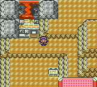

# Pokémon Polished Crystal

This is a custom Pokémon game based on [the Pokémon Crystal disassembly](https://github.com/pret/pokecrystal).

My goal is to create what the title says: an improved, polished version of Pokémon Crystal. It fixes bugs, takes into account the official game changes since 2001, and adds some new ideas of my own. Many features restore what was removed from R/B/Y, or original to HG/SS.

I've had vague plans to make a Pokémon game for years. I'm very impressed by the effort that's gone into disassembling Pokémon Crystal and making the code so well-organized. Thanks to making it open-source (and to the ROM hackers that inspired me), I'm finally making this game a reality.

> There are many ways to create games but the way we work at Game Freak may be a little different from other companies. That is, we constantly change and tweak what we have come up with. To make a fun game even more fun and polish it up, we take what we have made and start thinking about it from scratch. And to make the game the most fun to play we make endless changes and tweaks no matter how long it takes. It may not be the best way, but I think these tweaks are important to make our games fun and better.

– Junichi Masuda, "[HIDDEN POWER of masuda No. 7](https://www.gamefreak.co.jp/blog/dir_english/?p=21)"

> We've been greedy in the amount of gameplay elements we've squeezed in there. There's so much included that I even had colleagues saying to me: "Are you sure you should be going this far with a remake?" In that sense, it's not simply a remake—I think it's more than that. For that reason, I would like to see these games enjoyed by as large a number of people as possible.

– Shigeki Morimoto, "[Iwata Asks – Pokémon HeartGold Version & SoulSilver Version](https://www.nintendo.co.uk/Iwata-Asks/Iwata-Asks-Pokemon-HeartGold-Version-SoulSilver-Version/Iwata-Asks-Pokemon-HeartGold-Version-SoulSilver-Version/6-Pokemon-Players-Past-and-Present/6-Pokemon-Players-Past-and-Present-226100.html)"

## Download and Play

The most recent version is 2.2.0 as of September 20, 2016.

To play, download the .ips patch file, and use a tool like [Lunar IPS](http://fusoya.eludevisibility.org/lips/) (for Windows), [MultiPatch](http://projects.sappharad.com/tools/multipatch.html) (for OS X), or [UniPatcher](https://play.google.com/store/apps/details?id=org.emunix.unipatcher&hl=en) (for Android) to apply the patch to a default Crystal ROM.

This is the ROM you should use:

* Pokémon - Crystal Version (UE) (V1.0) [C][!].gbc  
  (`md5: 9f2922b235a5eeb78d65594e82ef5dde`)

It's identical to the one built by the [pokecrystal](https://github.com/pret/pokecrystal) project.

*If you want to do a [Nuzlocke Challenge](http://bulbapedia.bulbagarden.net/wiki/Nuzlocke_Challenge), check out Nuzlocke mode in the Option menu!*

There are two patches for Polished Crystal. The "faithful" patch does not change any Pokémon base stats or move attributes beyond the updates in Gen VI. The regular patch has some custom changes for more diverse and viable Pokémon.

* [Pokémon Polished Crystal 2.2.0](patches/polishedcrystal-2.2.0.ips)  
  (IPS patch file `md5: 043769cc7e1a0ccfad635ff72b0ab8d0`)  
  (Patched GBC ROM `md5: 9d3a3026bc3730cdf5d813b0bfe49697`)
* [Pokémon Polished Crystal (Faithful) 2.2.0](patches/polishedcrystal-faithful-2.2.0.ips)  
  (IPS patch file `md5: 5cbd4bef0e03936291f40b14c75b47d3`)  
  (Patched GBC ROM `md5: cb5921d6646d2adfd302d8957e5e39af`)

## Features

A full list of features is in [FEATURES.md](FEATURES.md). Some highlights:

* 253 Pokémon, including some new evolutions.
* 48 new moves.
* 65 TMs and 21 move tutors.
* Many new mechanics, including the Fairy type, Physical/Special split, Natures, unlimited TMs, Running Shoes, and continuous Repel.
* New maps: some restored from R/B/Y, some devamped from HG/SS, and some original.
* New characters, including Lorelei and Agatha from R/B/Y, Lyra and the Team Rocket Executives from HG/SS, and others.
* More post-game content, like Gym Leader rematches and an event after the battle with Red.
* An improved level curve with steadily increasing challenges throughout the game.
* Music and graphics devamped from other versions.
* Nuzlocke mode in the Option menu, enabling the basic rules of the [Nuzlocke Challenge](http://bulbapedia.bulbagarden.net/wiki/Nuzlocke_Challenge).

## Screenshots

  

  

  

  

  

  

  

  

  

  

## Discussion

You can post questions or comments on any of these sites.

* [Skeetendo](https://hax.iimarck.us/topic/6874/)
* [PokéCommunity](http://www.pokecommunity.com/showthread.php?t=373172)
* [/r/PokemonROMHacks](https://www.reddit.com/r/PokemonROMhacks/comments/51kbcn/pok%C3%A9mon_polished_crystal_200/)
* [Nuzlocke Forums](http://s7.zetaboards.com/Nuzlocke_Forum/topic/11003710/)
* [Pokémon Hackers Online](http://www.pokemonhackersonline.com/showthread.php?t=15811)
* [Romhack.me](http://www.romhack.me/polishedcrystal/wall/)

## FAQ

**Is there a Pokédex document I can refer to?**

The game's data files do a fairly good job of listing things you'll want to know.

* [Base stats and TM learnsets](data/base_stats/)
* [Level-up learnsets and evolution methods](data/evos_attacks.asm)
* [Egg moves](data/egg_moves.asm)
* [Move attributes](battle/moves/moves.asm)
* [TM+HM+tutor list](engine/tmhm.asm#L48)
* [Wild Pokémon](data/wild/)

**How do I evolve my Pokémon?**

* Item trade evolutions (like Seadra into Kingdra while holding a Dragon Scale) now evolve while holding the item.
* Yanma, Tangela, and Piloswine evolve while knowing AncientPower.
* Eevee evolves into Leafeon in Ilex Forest, site of the Moss Rock.
* Eevee evolves into Glaceon in the Ice Path, site of the Ice Rock.
* Eevee evolves into Sylveon with a Shiny Stone.
* Magneton evolves into Magnezone in Rock Tunnel, site of the Lodestone.
* Machoke, Graveler, Haunter, and Kadabra evolve by having sufficient EVs in Attack, Defense, Speed, and Special respectively (five Protein, Iron, Carbos, or Calcium is enough).

**Where do I get the legendary Pokémon?**

* Articuno is in the Seafoam Islands.
* Zapdos is above the Power Plant after you fix the generator.
* Moltres is inside Cinnabar Volcano.
* Raikou and Entei are roaming Johto after you awaken them.
* Suicune is in the Bell Tower after you get the Clear Bell.
* Lugia is in the Whirl Islands after you catch all three legendary birds and then get the Silver Wing in Victory Road.
* Ho-Oh is atop the Bell Tower after you catch all three legendary beasts and then get the Rainbow Wing in Bell Tower.
* Mewtwo is in Cerulean Cave.
* Mew and Celebi are a secret!

**Where do I get this item?**

* Helix Fossil and Dome Fossil are in Quiet Cave.
* Old Amber is in Pewter City.
* Razor Claw is in Quiet Cave, or held by some wild Sneasel.
* Razor Fang is in Victory Road, or held by some wild Gligar.
* Electirizer is in Rock Tunnel, or held by some wild Electabuzz.
* Magmarizer is on Cinnabar Island, or held by some wild Magmar.
* Protector is in Mt. Mortar, or held by some wild Rhydon.
* Up-Grade is given to you in Silph Co. after fixing the Power Plant generator.
* Dubious Disc is in Celadon City.
* King's Rock is in Slowpoke Well, or held by some wild Slowpoke/Slowbro and Poliwhirl.
* Metal Coat is in the Goldenrod Dept. Store basement, or held by some wild Magnemite/Magneton and Steelix.
* Dragon Scales are in Dragon's Den and Mount Mortar, or held by some wild Horsea/Seadra and Dratini/Dragonair.
* Dusk Stones are in Dark Cave, Quiet Cave, Cerulean Cave, and Mt. Moon. Bill's grandpa also gives you one.
* Shiny Stones are in National Park, Cherrygrove Bay, and Mt. Moon. Bill's grandpa also gives you one.
* Bill's grandpa gives you one of each evolution stone in Goldenrod City. Also, certain trainers will call you up to give you stones, just like in regular Crystal. The Celadon Dept. Store sells the Fire, Water, Thunder, and Leaf Stones.

**Where do I get Silver/Gold Leaves?**

Silver Leaves are like Shards in future generations: they can be given to Move Tutors to learn moves. Wild Oddish have a 50% chance of holding Silver Leaves, and there are some hidden on the ground in Ilex Forest.

Gold Leaves can be given to the Move Maniac to relearn moves. Wild Bellsprout have a 50% chance of holding Gold Leaves, and there are some hidden on the ground in Yellow Forest.

**Where do I get this TM/HM?**

* HM02 Fly is given to you after a certain battle in Yellow Forest, at the end of Route 47+48, which become accessible after beating Chuck.
* HM06 Whirlpool is given to you after a battle with Lyra on Route 42, which becomes accessible after beating Jasmine.
* TM46 Thief is given to you by Lance after completing Team Rocket's Base in Mahogany Town.

**What do blessings and photographs do?**

Daily blessings in Ecruteak City and photographs in Cianwood City make your Pokémon happier, just like haircuts or grooming.

**I don't like non-canon Pokémon types!**

I was hesitant to make original changes like this, because the goal is to be an improved Crystal version, not a new game. In the end I made two versions, one regular (with changes) and one "faithful" (with original typings).

## Bugs

[TODO.md](TODO.md) contains a full list of possible future changes, including these bugs to fix:

* Nuzlocke mode sometimes turns on by itself.
* TMs can restore PP.
* Some NPC trainers incorrectly use X Spcl. Atk.
* Avalanche's power doesn't double if the user is hit first.

## Changes in 3.0.0

These changes have been made since the current 2.2.0 release. If you build the project as-is, it will include all of them.

* Add: Medicine and Berry pockets in the Bag.
* Add: Store up to 20 phone numbers in Pokégear.
* Add: Always keep the option to Teleport away from Indigo Plateau.
* Add: Portrait for the meteorite in Pewter Museum.
* Add: Special sprite for Red's Pikachu.
* Add: Johto and Kanto forms for Arbok.
* Add: Drain Kiss drains 75% HP.
* Add: Update Pokémon, move, and item attributes to Gen VII:
   * Super Potion heals 60 HP.
   * Hyper Potion heals 120 HP and costs ¥1500.
   * Fresh Water heals 30 HP.
   * Soda Pop heals 50 HP.
   * Lemonade heals 70 HP and costs ¥400.
   * X items sharply raise stats and cost twice as much.
   * Tackle has 40 power.
   * Sucker Punch has 70 power.
   * Leech Life has 80 power and 10 PP.
   * Thunder Wave has 90% accuracy.
   * Swagger has 85% accuracy.
   * Paralysis halves (not quarters) Speed.
   * Burn does 1/16 (not 1/8) damage per turn.
   * Confusion has a 33% chance (not 50%) to hit self.
   * Gengar has the ability Cursed Body. (Can also have Levitate in non-Faithful.)
   * Raikou, Entei, and Suicune have the hidden ability Inner Focus. (Faithful only.)
   * New item: Protect Pads (abbreviated "Protective Pads"). "Protect the holder from effects caused by making direct contact with the target."
   * Paralysis halves Speed.
   * Timer Ball catch rate multiplier is 1 + (turns passed * 3) / 10.
   * Nest Ball catch rate multiplier is (41 − enemy mon level) / 5.
* Add: Flash is required to return Falkner to the Gym.
* Add: Replace Spike Cannon with Icicle Spear.
* Add: Replace Twineedle with U-turn.
* Add: Replace Whirlwind with Sucker Punch.
* Add: Replace Vital Throw with Aura Sphere.
* Add: Replace Nightmare with Facade.
* Add: Giga Impact.
* Add: NPC trainers can have nicknamed Pokémon.
* Add: NPC trainers can have custom EVs.
* Add: Accuracy and evasion work like in Gen VI.
* Add: Substitute blocks sound-based moves.
* Add: Gen III critical hit mechanics (ignore -Atk and +Def stat changes, don't ignore burn).
* Add: Grass-type Pokémon are immune to PoisonPowder, Stun Spore, Sleep Powder, and Spore.
* Add: Marowak is Ground/Ghost.
* Add: Charizard is Fire/Dragon.
* Add: Yanma is Bug/Dragon.
* Add: Ampharos is Electric/Dragon.
* Add: Noctowl is Ghost/Flying.
* Add: Politoed can learn Energy Ball.
* Add: Pidgeot can learn Focus Blast.
* Add: Misdreavus can learn Disarm Voice.
* Add: Espeon can learn Power Gem.
* Add: Give in-game trades good natures.
* Add: TM prices from OR/AS.
* Add: Show quantity in Bag in marts.
* Add: Get a free Premier Ball with every 10 Balls bought.
* Add: Show Pokémon portraits when using field moves (thanks to TPP:AC).
* Add: Time boundaries from HG/SS (day lasts until 8 PM, not 6 PM).
* Add: Use DVs to vary Pokémon colors like in Stadium.
* Add: Update random Wonder Trade OT names.
* Add: Rock Smash has 60 power (non-Faithful).
* Add: Strength is Fighting-type (non-Faithful).
* Add: Submission has 120 power (non-Faithful).
* Add: Trainers have max happiness for Return.
* Add: 1/2048 chance for Wonder Traded Pokémon to have Pokérus.
* Add: Buy 12 Moomoo Milk at once.
* Add: Show TM names before buying them and when picking them up.
* Add: Say which pocket is full if an item can't be picked up.
* Add: Use Yellow's encounter music for Jessie & James.
* Add: Large red Gyarados sprite.
* Add: Route 23 between Pokémon League Gate and Victory Road.
* Add: Oak's lab looks different from Elm's lab.
* Add: Grass-green for Faraway Island.
* Add: TM prices from OR/AS.
* Add: 15 Atk/10 Def DVs result in a Naive nature (+Spe −Sp.Def), not Hardy (neutral).
* Add: Update random Wonder Trade OT names.
* Add: Use original Jynx sprite.
* Add: Make overworld sprites darker at night.
* Add: Goldenrod Dept. Store and Celadon Mansion roofs have a dark sky at night.
* Add: Olivine Gym has its two trainers from HGSS.
* Add: Unlock frame type 9.
* Add: Choose a typeface/font.
* Add: XY Bicycle music for Cycling Road.
* Add: Prof.Oak gives you the Oval Charm for seeing all 253 Pokémon, and the Shiny Charm for catching all 253.
* Add: Prof.Elm is in the intro.
* Add: Cosplayer, Bug Maniac, Ruin Maniac, Lady, Baker, Tamer, Artist, Aroma Lady, Sightseer♂, and Sightseer♀ trainer classes.
* Add: New Trainer Card based on the Name Cards from the Mobile Adapter system.
* Add: Show PC box quantity.
* Add: Pokémon stats show caught Poké Ball.
* Add: Nest, Net, Dive, Luxury, and Heal Balls.
* Add: Cerulean Bike Shop from HGSS.
* Add: Elite 4 rooms have floor arenas.
* Add: Confirm gender selection.
* Add: Colored party Pokémon icons.
* Add: Magikarp Jump patterns.
* Add: Headbutt trees to get Silver and Gold Leaves.
* Add: Smash rocks to get various items.
* Add: Item maniacs from B/W.
* Add: Fish to get items based on the Rod (Bottle Caps with Super Rod).
* Add: Mulch regrows Berries.
* Add: Three battle styles: set, switch, and predict.
* Add: Battle Scene → Battle Effects.
* Add: Final Lyra battle.
* Add: Unown ! and ?.
* Add: In-battle symbol to show that Nuzlocke mode prevents capture.
* Add: Status icons in battle.
* Add: Reset initial options by pressing Left+B at the title screen.
* Add: Music resumes where it left off after a battle (from TPP).
* Add: Use a proper menu for resurrecting Fossils.
* Add: Instant text option.
* Add: Imperial or metric units.
* Add: 12-hour or 24-hour clock.
* Add: Item icons in the Bag.
* Add: Replace Jigglypuff Poster with Marill Poster.
* Add: Briefly beep to warn of low HP.
* Add: Play B/W final Pokémon music for Gym Leaders and Elite 4.
* Add: New title music after beating the Elite 4.
* Add: Larger Kanto routes, like in RBY.
* Add: Proper inverted colors in battle (by MeroMero).
* Add: Evolution moves from Gen VII.
* Add: Move Reminder supports pre-evolution and evolution moves.
* Add: Dark battle intro at night.
* Add: Show genders in party menu.
* Add: Vending machines have a 1/32 chance of giving an extra item.
* Add: Cross whirlpools, don't remove them (like HGSS).
* Fix: Lt. Surge's electric fence color does not override speech bubbles.
* Fix: Zap Cannon has 120 power.
* Fix: Pay Day pays 5 times the user's level, not 2.
* Fix: Explosion and Self-Destruct do not halve Defense.
* Fix: Quick Ball catch rate multiplier is 5 on the first turn.
* Fix: Minimize raises evasion by two stages.
* Fix: Munchlax, Magnezone, and Tangrowth have their relatives' cries.
* Fix: Game console names in room.
* Fix: Yellow Forest gate clerk does not face you.
* Fix: Read hidden Ruins of Alph tablet from one direction.
* Fix: Ice Rock tile collision data.
* Fix: Adjust some trainer levels and rosters.
* Fix: Move a trainer in Viridian Gym to prevent getting stuck on spinners.
* Fix: Fix some sprites.
* Fix: Sandstorm and Hail double, not halve, Special Defense and Defense.
* Fix: Enemy Psystrike uses player's Defense.
* Fix: Sketch fails if user is transformed.
* Fix: Wild encounter battle transitions correctly depend on relative levels.
* Fix: Dig and Fly prevent capture.
* Fix: Yellow Carpet is buyable.
* Fix: Tangrowth can learn Curse.
* Fix: Lyra's Bag is the female version.
* Fix: Incorrect Cowgirl and Misty sprites.
* Fix: Pokémon caught during the Bug-Catching Contest are recorded as caught in Goldenrod Harbor.
* Fix: Magnet Train tracks were missing tiles.
* Fix: Shiny icon is the star from Gen 3+.
* Fix: SPRITE_DRAGONITE uses Dragonite's side view.
